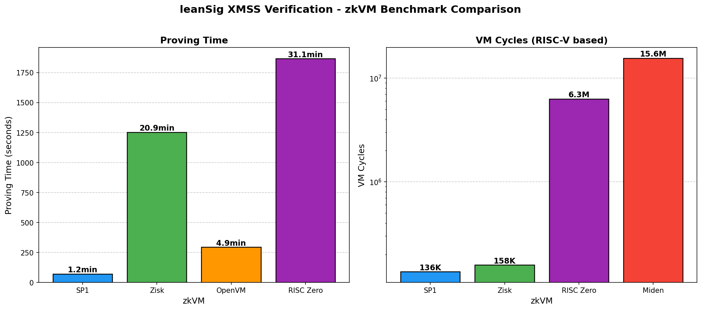

# LeanSig zkVM Benchmarks

Benchmarking XMSS signature verification from [leanSig](https://github.com/geometryxyz/leanSig) across multiple hash-based zkVMs.

| zkVM | Status |
|------|--------|
| [SP1](sp1/README.md) | Done |
| [Zisk](zisk/README.md) | Done |
| [RISC Zero](risc0/README.md) | Done |
| [OpenVM](openvm/README.md) | Done |
| [Miden](miden/README.md) | WIP |

## XMSS Configuration

| Parameter | Value |
|-----------|-------|
| Tree Height | 18 (2^18 = 262,144 signatures) |
| Hash Function | Poseidon2 (KoalaBear field) |
| Encoding | TargetSum W=1 (155 chains) |

## Benchmark Summary

*Proving times measured on macOS (Apple Silicon). Linux with AVX2/AVX-512 expected 5-10x faster.*

## References

- [LeanSig Paper](https://eprint.iacr.org/2024/1205)
- [SP1 Docs](https://docs.succinct.xyz)
- [Zisk Docs](https://docs.zisk.io)
- [RISC Zero Docs](https://dev.risczero.com)
- [OpenVM Docs](https://docs.openvm.dev)
- [Miden VM Docs](https://docs.polygon.technology/miden)
